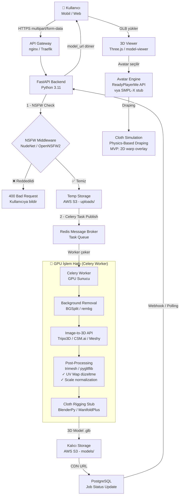

# 🏗️ Virtual Try-On MVP — Sistem Mimarisi

## Veri Akış Şeması (Data Flow Diagram)



---

## Katman Bazlı Teknoloji Seçimleri

### 1️⃣ Frontend
| Bileşen | Teknoloji | Neden |
|---------|-----------|-------|
| Web App | React + Vite | Hızlı dev, Three.js entegrasyonu kolay |
| 3D Viewer | `<model-viewer>` / Three.js | GLB/GLTF native render |
| Mobil | React Native (Expo) | Kod paylaşımı |
| UI State | Zustand | Lightweight |

### 2️⃣ API Katmanı
| Bileşen | Teknoloji | Neden |
|---------|-----------|-------|
| API Framework | **FastAPI** | Async native, otomatik OpenAPI docs |
| API Gateway | **nginx** → reverse proxy | SSL termination, rate limiting |
| Auth | JWT + OAuth2 (FastAPI built-in) | Standart |
| Rate Limiting | `slowapi` (Starlette middleware) | Kötüye kullanım önleme |

### 3️⃣ Asenkron İşlem Hattı
| Bileşen | Teknoloji | Neden |
|---------|-----------|-------|
| Task Queue | **Celery 5** | Python native, GPU worker yönetimi |
| Message Broker | **Redis 7** | Hızlı, Celery ile mükemmel uyum |
| Task Monitoring | **Flower** (Celery UI) | Worker/task görselleştirme |

> [!IMPORTANT]
> GPU sunucu ayrı bir makine/pod olmalıdır. API sunucusundan fiziksel/network olarak ayrılmalı; maliyet optimizasyonu için **spot instance** (AWS EC2 g4dn.xlarge) kullanılabilir.

### 4️⃣ Yapay Zeka Servisleri (MVP Seçenekleri)
| Adım | Seçenek A (Ücretsiz/Açık Kaynak) | Seçenek B (API - Hızlı MVP) |
|------|----------------------------------|------------------------------|
| Background Removal | `rembg` (U2Net) — local | Remove.bg API |
| Image → 3D Model | `TripoSG` (HuggingFace) | **Tripo3D API** / Meshy.ai |
| NSFW Detection | `NudeNet` (local inference) | SightEngine API |
| Avatar | SMPL-X body model | **ReadyPlayerMe API** |
| Cloth Simulation | Blender bpy headless | **MVP: 2D warping** |

> [!TIP]
> **MVP önerisi:** Tripo3D API + ReadyPlayerMe API + NudeNet local. Bu kombinasyon en az özel GPU gerektirir ve en hızlı pazara çıkma süresini sunar (~4-6 hafta geliştirme).

### 5️⃣ Depolama ve Veritabanı
| Bileşen | Teknoloji |
|---------|-----------|
| Medya Dosyaları | **AWS S3** (veya MinIO – self-hosted alternatif) |
| CDN | **CloudFront** (S3 presigned URL veya public CDN) |
| Ana Veritabanı | **PostgreSQL** (job durumu, kullanıcı profili, kıyafet kataloğu) |
| Cache | **Redis** (session, frequent queries) |

### 6️⃣ Altyapı ve DevOps
| Bileşen | Teknoloji |
|---------|-----------|
| Containerization | **Docker** + Docker Compose |
| Orchestration (Scale) | **Kubernetes** (Phase 2) / docker-compose (MVP) |
| CI/CD | GitHub Actions |
| GPU Instance | AWS EC2 g4dn.xlarge (T4 GPU, ~$0.50/hr spot) |
| API Instance | AWS EC2 t3.medium (CPU only) |
| Secrets | AWS Secrets Manager / `.env` |

---

## Tam Mimari Bileşen Tablosu

```
┌─────────────────────────────────────────────────────────────────┐
│                         INTERNET                                │
└─────────────────────────┬───────────────────────────────────────┘
                          │
              ┌───────────▼───────────┐
              │   nginx / Traefik     │  ← SSL, rate limit
              │   API Gateway         │
              └───────────┬───────────┘
                          │
              ┌───────────▼───────────┐
              │   FastAPI App         │  ← CPU-only instance
              │   (Uvicorn ASGI)      │    t3.medium
              └──┬──────────────┬─────┘
                 │              │
    ┌────────────▼──┐    ┌──────▼──────────┐
    │  PostgreSQL   │    │  Redis           │
    │  (RDS/local)  │    │  (ElastiCache    │
    │               │    │   / local)       │
    └───────────────┘    └──────┬───────────┘
                                │ Celery Task
              ┌─────────────────▼───────────────┐
              │   Celery Worker(s)               │
              │   GPU Instance: g4dn.xlarge      │
              │   ┌─────────────────────────┐   │
              │   │  rembg → Tripo3D API    │   │
              │   │  → post-process → S3    │   │
              │   └─────────────────────────┘   │
              └──────────────────────────────────┘
                                │
              ┌─────────────────▼───────────────┐
              │   AWS S3                         │
              │   /uploads  (temp images)        │
              │   /models   (final .glb)         │
              └──────────────────────────────────┘
```

---

## İş Akışı Özeti (6 Adım)

1. **Upload & Validate:** Kullanıcı fotoğraf yükler → FastAPI `POST /garments/upload` → NSFW middleware çalışır
2. **Queue:** Temizse S3'e yüklenir, Celery task publish edilir → `job_id` kullanıcıya döner
3. **Background Removal:** Worker `rembg` ile arka planı kaldırır
4. **3D Reconstruction:** Tripo3D API'ye çağrı → GLB dosyası alınır
5. **Post-processing & Storage:** Scale normalize, UV düzelt → S3 `/models/` klasörüne yükle → DB güncelle
6. **Notify & Render:** Frontend polling veya WebSocket ile job tamamlandığını alır → Three.js ile render eder
